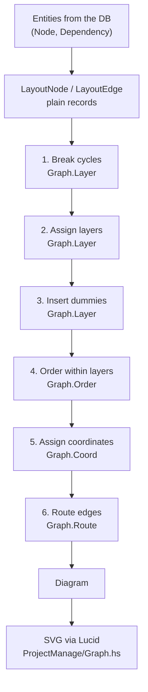

# Dependency Graph Rendering — the layered visualization

> **The pipeline below is shared; the drawing it produces is not.**
> `Domain.Project.Graph.*` is the layered layout engine, and it is
> *shared infrastructure* — any visualization that wants layered
> geometry uses this one copy. Two do: `viz:layered` and `viz:rootless`,
> which differ only in what they hand the engine, not in how the engine
> works. Which drawing the app serves is selected by a
> `visualizationMode` query parameter; see
> [`visualization-switching.md`](visualization-switching.md) for the
> switch and for where the line between shared and per-visualization
> falls.
>
> So read everything below as geometry, not as policy. Statements here
> about the project root — that it heads the drawing, that its edges are
> derived — describe what the *layered* visualization asks for. The
> rootless one asks for neither, and the engine neither knows nor cares.
>
> The one thing most worth understanding here: every edge means "the
> upper node is waiting on the lower one", but only some are *stored*.
> The root-to-work edges are derived from `node.project_id` rather than
> read from `project.dependency`, and the root attaches only to the
> *heads* of the work, not to every node. See
> [Stored edges and derived ones](#stored-edges-and-derived-ones).

The graph is rendered server-side as finished SVG: there is no
client-side layout code, and no graph data is sent to the browser.

For *why* any of this was chosen — the options weighed, the algorithms
rejected, the requirements derived from the reference images — see
[`../solution-proposals/haskell-graph-rendering.md`](../solution-proposals/haskell-graph-rendering.md).
That document is a frozen decision record; **this** one is the live
reference. When they disagree, this one wins and the other one is
history.

For how to *work with* the surrounding code — running the app, the
`#container`/`#view` pattern, Lucid conventions, running the test suites
— see [`../development/`](../development/). This doc covers the graph's
design; that directory covers the day-to-day.

## What this is, in one paragraph

The server computes positions and the client receives finished SVG.
Layout is a pure Haskell pipeline of the
[layered graph drawing](https://en.wikipedia.org/wiki/Layered_graph_drawing)
family (nodes in rows by dependency depth, edges as right-angle
polylines), rendered to SVG by the Lucid vocabulary. No graph data is
sent to the browser, and no JavaScript computes a position.

D3 does appear once more on the client, and the distinction matters:
The viewport uses `d3-zoom` to pan and zoom the finished drawing.
That is a *gesture* library, not a layout one — it moves a single
transform and never reads the graph's structure — and it is ~47KB
loaded only by the graph fragment. See [Viewport](#viewport).

## The pipeline



Everything from `LayoutNode`/`LayoutEdge` to `Diagram` is pure. The
responder does the I/O on either side of it and nothing else.

## Module map

| Module | Owns |
|---|---|
| `Domain.Project.Graph.Types` | Every type below; no logic |
| `Domain.Project.Graph.Containment` | Which work the root attaches to |
| `Domain.Project.Graph.Layer` | Cycle breaking, layer assignment, dummy insertion |
| `Domain.Project.Graph.Order` | Crossing reduction, crossing counter |
| `Domain.Project.Graph.Coord` | x/y assignment, component packing |
| `Domain.Project.Graph.Route` | Ports, tracks, polylines, line jumps |
| `Domain.Project.Graph.Layout` | The pipeline; the one entry point callers use |
| `Domain.Project.Responder.Ui.ProjectManage.Graph` | Queries, entity → layout conversion, SVG rendering |

### The one hard rule

**Nothing under `Domain.Project.Graph.*` may import `Database.*`,
`persistent`, `Esqueleto`, `Lucid`, or anything from `Network.Wai`.**

The layout engine takes plain records and returns plain records. This is
not stylistic: it is what keeps these modules inside the "pure,
dependency-free" tier that
[`../development/unit-testing.md`](../development/unit-testing.md) says the unit suite covers,
alongside `Common.Validation` and `Data.Text.Util`. A single `persistent`
import in `Graph.Coord` would drag the whole pipeline into the
integration-test tier and cost this effort its main advantage over the
JS it replaces.

Conversion lives in the responder: entities in, `LayoutNode`/`LayoutEdge`
out, `Diagram` back, SVG rendered.

## Core types

```haskell
-- Domain.Project.Graph.Types

newtype NodeId = NodeId Int64  deriving (Eq, Ord, Show)
newtype EdgeId = EdgeId Int64  deriving (Eq, Ord, Show)

data NodeKind = RootNode | WorkNode deriving (Eq, Show)

data LayoutNode = LayoutNode
  { lnId    :: NodeId
  , lnKind  :: NodeKind
  , lnLabel :: Text        -- raw title; wrapped during rendering
  }

data EdgeKind = DependsOn | Contains deriving (Eq, Show)

data LayoutEdge = LayoutEdge
  { leId    :: EdgeId
  , leKind  :: EdgeKind
  , leUpper :: NodeId       -- drawn above leLower
  , leLower :: NodeId
  }

-- Build them with these, never the record:
dependsOn :: EdgeId -> NodeId -> NodeId -> LayoutEdge  -- dependency, dependent
contains  :: EdgeId -> NodeId -> NodeId -> LayoutEdge  -- container, contained
```

**Use `dependsOn`/`contains`, never the `LayoutEdge` record.** See
[Edge direction](#edge-direction-and-the-trap-it-hides) — the
constructors are the guard rail, because they take their arguments in
the relationship's own terms. Generic field names are what let the
previous renderer point its arrowheads at the wrong end for as long as
it did, and writing the root's edge the wrong way round is what sank the
root to the bottom of the drawing.

```haskell
data Point = Point { ptX :: Double, ptY :: Double }
data Size  = Size  { szW :: Double, szH :: Double }
data Bounds = Bounds { bMin :: Point, bMax :: Point }

data PlacedNode = PlacedNode
  { pnId      :: NodeId
  , pnKind    :: NodeKind
  , pnLines   :: [Text]   -- label, already wrapped to the box
  , pnTopLeft :: Point
  , pnSize    :: Size
  }

data PlacedEdge = PlacedEdge
  { peId       :: EdgeId
  , pePoints   :: [Point] -- polyline; last point sits on the upper
                          -- node -- the one waiting -- and carries
                          -- the arrowhead
  , peReversed :: Bool    -- reversed for layering only (see §Cycles);
                          -- does NOT change which end is the arrow
  , peJumps    :: [Point] -- where this edge's horizontal runs hop over
                          -- another edge's vertical (see §6)
  }

data Diagram = Diagram
  { diagramNodes      :: [PlacedNode]  -- real nodes only; never dummies
  , diagramEdges      :: [PlacedEdge]
  , diagramBounds     :: Bounds
  , diagramRootAnchor :: Maybe Point   -- what the viewport opens on
  }

data LayoutConfig = LayoutConfig
  { cfgNodeSize    :: Size
  , cfgLayerGap    :: Double  -- minimum vertical space between rows;
                              -- grows to fit the tracks crossing a gap
  , cfgNodeGap     :: Double  -- minimum horizontal space between boxes
  , cfgDummyWidth  :: Double  -- room a dummy reserves in a row it
                              -- crosses; a lane, not a whole box
  , cfgTrackGap    :: Double  -- vertical space between routing tracks
  , cfgLabelWidth  :: Int     -- characters per label line
  , cfgLabelLines  :: Int     -- maximum label lines
  , cfgMargin      :: Double  -- padding around the whole drawing
  , cfgJumpRadius  :: Double  -- radius of a line jump's arc
  }
```

And the entry point every caller uses:

```haskell
-- Domain.Project.Graph.Layout
layout :: LayoutConfig -> [LayoutNode] -> [LayoutEdge] -> Diagram
```

`layout` is **total**. It must produce a `Diagram` for any input: cycles,
duplicate edges, disconnected components, an empty graph, a node with no
project root. Layout never fails — see [Cycles](#cycles).

## Phase contracts

Each phase is a function from one representation to the next, and each
guarantees an invariant the next phase relies on. The invariants are
what the unit tests assert.

### 1. Break cycles — `Graph.Layer`

DFS from every unvisited node; an edge pointing back at a node currently
on the stack is a back edge and gets reversed for layout purposes, with
`peReversed` recorded. Tie-breaks by `NodeId`, so the choice is stable
across runs.

**Guarantees:** the edge set is acyclic.

### 2. Assign layers — `Graph.Layer`

Longest-path layering over a topological order: a node with **no
dependents** — nothing waiting on it — is layer 0; any other node sits
one row below the lowest of its dependents.

Note the direction. Layering runs *dependent to dependency*, so a node
is drawn above the work it is waiting on. Layering by *dependencies*
instead (a node with no dependencies at layer 0) would invert the
drawing and put the leaf tasks on top.

### Stored edges and derived ones

An edge carries an `EdgeKind`. **Both kinds draw the same thing** — the
upper node is waiting on the lower one, arrowhead on the upper end. What
differs is where the edge came from:

| Kind | Upper end | Comes from | Deletable |
|---|---|---|---|
| `DependsOn` | the dependent | a `project.dependency` row | yes |
| `Contains` | the project root | derived from `node.project_id` | no — there is no row |

**The project root heads the graph because it is waiting on its work.**
A project is not complete until its tasks are, so the root genuinely
depends on every node under it, and the arrow points into the root:
this work feeds the project.

Membership is **derived, never stored**. `node.project_id` already
records it, so writing a `project.dependency` row per node to say the
same thing would duplicate that column — and a `project.dependency` row
means a genuine ordering between two pieces of work and nothing else.

Build edges with `dependsOn`/`contains` rather than the `LayoutEdge`
record: the constructors take their arguments in the relationship's own
terms, which is the only thing that has reliably stopped this being
written backwards.

#### Which work the root attaches to

Derived does not mean "one per node". `Graph.Containment` attaches the
root to the **heads** of the work — nodes nothing else is waiting on —
and to nothing else. A node further down already hangs below a head and
reaches the root that way, so the rule a reader can hold onto is: **a
node is attached to the root, or to other work, never both.**

Attaching the root to every node instead draws the project's real shape
and then buries it: on a chain of five, the root fans out to all five on
top of the four edges that describe the actual work, and it gets worse
the larger the project.

Two cases keep the drawing whole, and both are why this is a function
with tests rather than a filter inline:

- **A node with no dependencies at all is its own head**, so it keeps
  its root edge instead of floating away from the project.
- **A cycle has no head** — every node in it is something else's
  dependency. Left at the rule above, a wholly cyclic group would attach
  to nothing and drift off as an island, so anything left unreachable
  adopts an anchor until every node hangs off the root somewhere. Note
  this is answered on the recorded edges, *not* by asking `Graph.Layer`
  which edge it reversed: which edge breaks a cycle is layout's own
  business, and membership should not depend on that choice.

A stored row that already puts the root above a node counts as attached,
so no second edge is derived beside it.

> ⚠️ **Never record project membership as a `project.dependency` row.**
> A row pointing from a node *at* the root says "the root depends on
> this node" — and layering, working correctly, then draws every node
> above the root and sinks it to the bottom of the drawing. The layout
> rule is not what breaks; the relationship it is handed is. Membership
> comes from `node.project_id`, and the root's edges are derived from
> it.
>
> This failure is invisible from the code and from the tests: both the
> write and the layout are individually doing what they say. It shows up
> only by looking at the drawing.

**Guarantees:** every edge spans at least one layer, in a consistent
direction. Layers are contiguous from 0. Disconnected components are
layered independently.

### 3. Insert dummies — `Graph.Layer`

An edge spanning layers 2→5 becomes a chain through one dummy per
intervening layer.

A dummy reserves `cfgDummyWidth` of horizontal room, not a full node's
worth — a passing edge needs a lane, and charging it a whole box would
balloon any graph with long edges in it. Dummies also outrank real nodes
in phase 5's priority order, so a chain of them holds its line and the
edge travels straight down instead of zig-zagging around what it passes.

**Guarantees:** every edge connects *adjacent* layers, which is what
lets phases 4–6 stay simple.

**Dummies are internal.** They occupy a slot in their layer's ordering
and get coordinates, then phase 6 consumes each one as a bend point.
They never reach `Diagram`, and no element, id or label is ever emitted
for one. Their only visible effect is spacing: reserving room in the
rows an edge crosses is what opens the channel it routes along, and what
stops a multi-level edge being drawn through a node box.

### 4. Order within layers — `Graph.Order`

Seeded in slot order, then alternating down/up sweeps placing each node
at the median position of its neighbours in the adjacent layer, for a
fixed pass count, keeping the best ordering seen. A node with no
neighbours in the reference layer keeps its current place rather than
being flung to one end.

Sweeping has to alternate: ordering a layer to suit the one above will
happily make things worse for the one below. After every sweep crossings
are counted exactly — sorting the edges by where they start in the upper
layer, the crossings are the inversions in where they end in the lower
one — and a sweep that makes things worse is discarded rather than built
upon.

**Guarantees:** each layer's ordering is a permutation of its members.
The result is never worse than the input. Output is deterministic for a
given input.

Exactness matters here beyond the algorithm: it lets a test assert a
number rather than a judgement. `OrderSpec` pins two committed
fixtures — K(2,2), which no ordering can untangle below one crossing,
and a fully reversed three-layer graph, which the sweeps take from six
crossings to zero.

### 5. Assign coordinates — `Graph.Coord`

`y = layer * (nodeHeight + cfgLayerGap)`. `x` by the priority/median
method: each node wants the median x of its neighbours in the adjacent
layer; conflicts resolved in priority order (by number of connections
into that layer, with dummy chains first so long edges stay straight),
pushing lower-priority neighbours aside to preserve
`cfgNodeGap`. Four alternating down/up passes.

An even number of neighbours averages the middle two rather than picking
one, which is what centres a parent between exactly two children — the
commonest shape in the reference images, and one an odd-median would
visibly get wrong by parking the parent directly over one child.

**Row order is never changed within a component.** A node can be pushed,
never swapped past a neighbour. Reordering belongs to phase 4, and
keeping the two separate is what lets this run without undoing that.

**Then components are packed left to right.** A graph with no project
root — or one whose work falls into unrelated chains — is several
disconnected components, and placement alone does not keep them apart: a
component that is narrow at the top and wide further down spreads out
underneath its neighbour, leaving that neighbour sitting *inside* its
span rather than beside it. Two independent graphs then read as one
tangle.

So after placement, each component is translated rigidly, left to right,
until their bounding boxes are disjoint. Rigid translation is what makes
this safe to run after phase 4 has already chosen an order:

- **Crossings cannot change.** Edges exist only within a component and
  every component keeps its internal order, so no pair of edges swaps
  which side of the other it lies on. The count is invariant.
- **Boxes cannot start overlapping.** Slots within a component keep
  their separation exactly; slots in different components end up in
  disjoint spans at least `cfgNodeGap` apart.

A component is only ever pushed right, never pulled left, so a drawing
whose components were already clear of each other comes back untouched.

Pinned by tests in both `CoordSpec` and `LayoutSpec`: placement alone
looks correct on small graphs, and the packing is only visibly needed
once a component is narrow at the top and wide further down.

**Guarantees:** no two node boxes overlap; every pair is at least
`cfgNodeGap` apart horizontally.

### 6. Route edges — `Graph.Route`

- **Ports.** Each node side carries slots. An edge claims the slot
  matching the direction it arrives from; slots on a side are ordered by
  the opposite endpoint's position, so edges meeting the same side don't
  cross at the boundary. Multiple edges into one node get **distinct,
  spread** ports — never merged into a shared trunk.

  **Only the top and bottom sides are used, and that turned out to be
  enough.** R8 in the proposal reads the reference images as needing
  left and right ports too, for the edges that travel around the
  drawing. In practice a multi-row edge gets its own reserved lane
  (phase 3) and enters its target from above like any other, so the
  "routes around rather than through" requirement is met without side
  entry. Left/right ports would be a cosmetic change, not a structural
  one — don't add them expecting to fix a routing problem.
- **Tracks.** The inter-layer gap divides into horizontal tracks. Each
  horizontal run gets a track such that no two edges share a track *and*
  an overlapping x-interval (greedy interval colouring by span). The
  gap's height follows from the tracks actually used, so simple graphs
  stay tight.
- **Polylines.** Vertical out of the source port, horizontal along the
  track, vertical into the target port — at most two bends per adjacent-
  layer edge.
- **Line jumps**: after routing, horizontal/vertical crossings
  get a small arc in the horizontal segment so the reader can see the
  lines don't connect. In an orthogonal drawing nothing otherwise
  separates "these cross" from "these meet" — both are a black `+`.

  Three rules make it well-defined, and each is a test:
  - **Only the horizontal side hops.** Hopping both would put two arcs
    at one point and restore exactly the ambiguity the hop removes, so
    which side hops is arbitrary but must be consistent.
  - **The intersection must be strictly inside both runs.** Two edges
    meeting at a shared port touch at an endpoint; that is a junction,
    and a hop there would claim they pass by each other when they join.
  - **An edge never hops itself.** Its horizontal run meets its own
    verticals at both ends — those are corners.

  `addJumps` records the points on `peJumps`; the renderer turns each
  into a `cfgJumpRadius` semicircle, always bulging towards the top of
  the page (which means the SVG sweep flag flips with direction of
  travel). Keeping the geometry in `Graph.Route` is what keeps it in the
  unit-tested tier — `polyline` only draws what it is handed.

  Worth knowing: these fire often. Across 1200 generated graphs, 57%
  had at least one. What K(2,2) produces is *not* one of them — that
  shape's conflict is a shared vertical column, an overlap rather
  than a crossing, which is why a jump fixture has to be a little larger
  than the obvious one.

- **Vertical spacing is decided here, not in phase 5.** How tall a gap
  has to be is a function of how many tracks cross it, so `Graph.Route`
  returns each row's y alongside the edges. Phase 5 owns x; this phase
  owns y.

**Guarantees:** every segment is axis-aligned. No two runs from
different edges overlap collinearly, horizontal or vertical.
**No polyline intersects a node box** — unconditional, including
multi-row edges, since each one gets a reserved lane rather than being
left to miss the rows it passes by luck.

A multi-row edge bends at each end and runs straight in between, so it
occupies exactly three columns: the port it leaves, the lane it travels,
and the port it arrives at. More than two bends on such an edge is
expected — "at most two bends" is a property of a single segment, not of
a whole edge.

**Separating shared columns.** Two edges whose port columns
coincide would draw their vertical runs on top of each other wherever
those runs overlap in y — not a crossing, an overlap, which renders as
one edge instead of two. A lower port landing on a column another edge
already leaves from is nudged along its own node's edge until it clears.

**Reordering tracks cannot fix this**, which is worth knowing before
anyone tries. Where edge A's upper column is edge B's lower column, the
overlap needs A's track above B's. Two edges that *swap* ports — K(2,2)
is the smallest case — demand that in both directions at once, so they
would have to share a track, which they cannot, having identical
x-spans. The columns themselves have to differ.

Straight drops matter most here: with no track to stop at, one occupies
its column for the gap's whole height, so anything landing on it
overlaps completely.

This was more common than it looked. Before the fix, 40 of 1500
generated graphs (2.7%) contained at least one overlap; after, none do.

## Coordinate conventions

- SVG coordinates: **x right, y down**. One layout unit is one CSS pixel
  at the default zoom.
- **Row spacing is not uniform.** A gap is at least `cfgLayerGap` tall
  and grows to fit the routing tracks crossing it, so rows are placed by
  accumulating gap heights rather than by multiplying an index. Phase 6
  computes them.
- **Layer 0 is at the top**, at `cfgMargin`, and layer number increases
  downward. The project root heads the graph *because it is waiting on
  its work* — not by special-casing it. Nothing guarantees the root is
  alone in layer 0: a real dependency recorded as "task X depends on
  the project root" would put the root below X, which is the rule
  working correctly on data that says something unusual. What cannot
  happen is *every* node saying it, because the root's edges are derived
  rather than stored.
- `pnTopLeft` is the box's top-left corner, not its centre. (The
  client-side renderer this replaced positioned by centre; that habit
  deliberately did not carry over.)
- `diagramBounds` includes `cfgMargin` on all sides.

## Edge direction, and the trap it hides

**The rule:** `A → B` means **B depends on A being completed first**. The
arrowhead sits on **B, the dependent** — it points from the work that
must finish toward the work waiting on it.

Mapping to the database ([`../development/backend/database-schema.md`](../development/backend/database-schema.md)):
`project.dependency` stores `node_id` **depends on** `to_node_id`.
Therefore:

| Layout field | Database column | Gets the arrowhead? |
|---|---|---|
| `dependsOn`'s dependency | `to_node_id` | no — the tail |
| `dependsOn`'s dependent | `node_id` | **yes — the head** |

**The trap is that the natural-looking mapping is backwards.** A
conversion of the form `{ source = node_id, target = to_node_id }` with
`marker-end` on the target puts the arrowhead on the *dependency* — it
reads plausibly and draws the relationship the wrong way round.

This is exactly why `LayoutEdge`'s fields are named for the relationship
rather than `source`/`target`: with semantic names, getting it backwards
requires writing something that reads obviously wrong.

Reversed edges (from cycle breaking) are a layout-time device only. The
renderer still draws the arrowhead at the true dependent end.

## Rendering

`templateGraph :: Diagram -> Html ()` emits the whole drawing with
coordinates baked in. No `#graph-data` JSON, no layout script.

- `<svg>` carries a `viewBox` from `diagramBounds` **and** explicit pixel
  `width`/`height`, so it renders at natural size and overflows its
  container on a large project. It is deliberately *not* scaled to fit —
  see [Viewport](#viewport).
- Nodes: `<g class="node" transform="translate(x,y)">` wrapping a
  `<rect rx>` and a `<text>` of `<tspan>` lines.
- Edges: `<path class="link" d="M… L… L…">` with `marker-end`.
- New SVG elements/attributes go in `Common.Web.Elements` /
  `Common.Web.Attributes` — the established extension point (see
  [`../development/ui/haskell-rendering.md`](../development/ui/haskell-rendering.md)). `rect_`,
  `rx_` and `transform_` live there, not inline.
- **Only geometry is emitted as attributes.** Fill, stroke, hover, the
  highlight glow and the flash animation are all `manage-project.css`,
  keyed off the node's `.root`/`.work` class. A `stroke="white"` on the
  `<rect>` would render fine and still be wrong: it splits one node's
  appearance across two files and drops silently out of any theme
  change.

### Labels

Node boxes are a **fixed size**, and labels wrap to fit via
`Data.Text.Util.wrapLabel` at `cfgLabelWidth`/`cfgLabelLines`. This is
deliberate: the server cannot measure rendered text, so the alternative
would be a font-metrics table. Fixing the box and wrapping the label
sidesteps the problem entirely, and uniform boxes are the target look
anyway. Full titles remain available in the node detail panel.

### The DOM contract — do not change these

The CSS, the htmx wiring and the e2e suite all bind to these. Keeping
them stable through the cutover is what lets `e2e/tests/graph.spec.ts`
act as a regression check on the rewrite instead of being rewritten
alongside it.

| Selector | Depended on by |
|---|---|
| `#tree-container` | `manage-project.css` (sizing, and the viewport's clipping box) |
| `#graph-nodes`, `#graph-links` | `graph.spec.ts`, CSS |
| `#node-<id>` | `graph.spec.ts`, the node-detail refresh hook |
| `#node-text-<id>` | the per-node label refresh hook (`Node.Refresh`) |
| `.node`, `.node-highlight`, `.flash` | CSS, `graph.spec.ts` |
| `.root` / `.work` on the node's shape | CSS (fill, hover, glow, flash) |
| `.link` | CSS |
| `hx-get`/`hx-target="#node-panel"`/`hx-push-url` on each node | the whole node-detail interaction |

**Style rules key off the `.root`/`.work` class the shape carries, not
off the element name.** `manage-project.css` sets fill, hover, glow and
flash that way, which is what makes changing a node's shape cheap:
element names in selectors are what would make it expensive.

`graph.spec.ts`'s overlap assertion reads each box's own width and
height off the `rect` and tests real rectangle intersection, rather than
comparing centre distances against a nominal size — exact rather than a
proxy.

**`#node-text-<id>` is a contract, not an implementation detail.** The
label element and the hook that refreshes it are written ~40 lines apart
in `ProjectManage/Graph.hs`, and nothing in the type system ties them
together. A constant id here would both repeat one id across the
document and aim the refresh hook at an element that does not exist, and
neither shows up as an error — so it is pinned by an integration test
(`test-integration/…/ProjectManage/GraphSpec.hs`).

**Labels are positioned by a `transform` on the `<text>`, not by `x`/`y`
on it and every `<tspan>`.** That puts the text origin at the centre of
the node box, so `Node.Refresh` can return a label fragment that lands
correctly without knowing where the node sits.

The refresh endpoint is shared with the orbital drawing, whose circles
fit fewer characters per line than this box (12 against 18), so each
drawing tells it which width to wrap to — see
[`orbital-dependency-weighted-graph.md`](orbital-dependency-weighted-graph.md).

### Palette

The reference images supply **shape and layout only, not
colour**. The graph keeps the app's own theme: `global.css`'s
`--bg-start`/`--bg-end` background, `--accent-bold` for the root node,
`--accent-light` for work nodes, `--text-primary` for labels. See
[`../development/ui/design-system.md`](../development/ui/design-system.md).

## Viewport

The graph is a **navigable viewport, not a fit-to-screen picture**. A
large project is expected to overflow the view.

- **Opens at a fixed, readable scale** — never scaled down to fit, which
  would shrink titles past legibility on a big project.
- **Opens anchored on the project root**, using `diagramRootAnchor`
  emitted as a data attribute; the server already knows the coordinate,
  so the client never has to find it.
- **Pan and zoom are one transform**, written by `d3-zoom` onto the
  `#graph-zoom-layer` group inside the SVG. Nothing scrolls and nothing
  is resized.
- **No on-screen controls.** Gestures carry it: drag or plain wheel to
  pan, `ctrl`/`cmd`+wheel (what a trackpad pinch reports as) to zoom,
  double-click to reset. Arrow keys, `+`/`−` and `0` are the keyboard
  equivalents, and `#tree-container` stays focusable so they reach it —
  with no buttons, that keyboard path is the only pointer-free way
  around the graph.

### As built

`static/script/graph-viewport.js`, driving `d3-zoom`. It loads
from inside the graph fragment rather than once at page load, because
htmx replaces `#tree-container`'s contents wholesale on every graph
load — and that is also what keeps d3 off every other page in the app.

Six things in it are less obvious than the feature list above, and are
the parts to be careful around:

- **d3 is a gesture library here, not a layout one.** It moves a
  transform and never reads the graph's structure. The hard rule at the
  top of this document is unaffected: positions are computed in
  `Domain.Project.Graph.*` and no graph data is sent to the browser.
- **The SVG has no `viewBox`.** It is `width="100%" height="100%"`, so
  one user unit is one CSS pixel and the drawing sits at natural size
  until the transform says otherwise. A `viewBox` would scale it to fit
  the container, which is exactly the fit-to-screen behaviour the first
  bullet above rules out. An inner `<g>` translates the layout's bounds
  minimum to the origin, which is what makes the zoom layer's
  coordinates the same ones `data-root-x`/`data-root-y` are emitted in.
- **The vendored bundle is one file, not two.** `d3-selection` and
  `d3-zoom` are built from a single entry into
  `static/script/vendor/d3-graph-zoom.js`. Bundling them separately
  gives each its own copy of `d3-selection`'s prototype, so
  `d3-transition`'s `interrupt` patch lands on one copy while the
  selection handed to `d3-zoom` comes from the other — it fails at
  runtime with `interrupt is not a function`. The rebuild recipe is in
  that file's header.
- **It is a dynamic `import()` from a classic script**, not a
  `<script type="module">`. A module executes once per document however
  many times its tag is swapped in, so a module tag would set the
  viewport up on the first graph load and never again.
- **A drag must not read as a click.** Every node is also an htmx click
  target, so a gesture only counts as a pan once the transform has moved
  past a 4px threshold, and then the click the browser fires afterwards
  is swallowed exactly once in the capture phase.
- **Listeners are torn down on re-entry.** `#tree-container` survives
  each swap while its contents don't, so listeners bound to it would
  otherwise accumulate one set per graph load. Each run aborts the
  previous run's `AbortController` and clears d3's own `.zoom`
  listeners, which drops them all at once. The teardown is installed
  *before* the dynamic import resolves, so a fast second swap cannot
  race a half-initialised viewport.

`e2e/tests/graph.spec.ts` drives the gestures for real in a browser,
asserting on the zoom layer's `transform`. Integration assertions on the
emitted markup cannot cover a viewport: nothing about pan and zoom is
visible in what the server sends.

## Cycles

`project.dependency` permits cycles — `UNIQUE (node_id, to_node_id)`
stops duplicate edges, not loops — and no application-level validation
exists yet. Layering is only defined on a DAG, so phase 1 breaks cycles
by reversing back edges.

**Layout never refuses to draw.** Erroring on a detected cycle was
considered and rejected: a graph that won't display is a worse failure
than one drawn with an edge reversed, and it leaves the user no way to
*see* the cycle in order to fix it.

Preventing cycles at write time is planned as an application feature and
is not part of this effort. When it lands, this phase becomes a backstop
for data that arrived another way (direct SQL, seed scripts, rows
predating the validation) rather than an expected path. It stays either
way: a renderer that assumes well-formed input is a renderer a single
database row can break.

## Testing

Specs mirror the module path, per [`../development/unit-testing.md`](../development/unit-testing.md):

```
test/Domain/Project/Graph/LayerSpec.hs
test/Domain/Project/Graph/OrderSpec.hs
test/Domain/Project/Graph/CoordSpec.hs
test/Domain/Project/Graph/RouteSpec.hs
```

**`hspec-discover` finds the files, but `typeio.cabal`'s
`test-suite spec` stanza lists every spec module under `other-modules`
by hand — a new spec that isn't added there is silently never run.**

The invariants each phase guarantees are the test suite. At minimum:

- No two node boxes overlap, on every fixture.
- Every edge polyline is entirely axis-aligned.
- No edge polyline intersects a node box.
- No two horizontal runs share a track and an overlapping x-interval.
- Every edge's dependency layer is above its dependent's, back edges
  excepted.
- A cyclic input terminates and yields a complete `Diagram`.
- Crossing count on committed fixtures stays at or below a recorded
  baseline.
- The same input yields identical output across runs.

This was the point of the whole exercise, and it paid off. None of the
above was expressible against the JS this replaced: Playwright drives
the finished page and could not call the client's layout code, so the
app's most intricate logic had exactly one smoke test asserting four
nodes landed somewhere without overlapping. The layout engine now
carries ~40 unit examples over committed fixtures, and it runs in
milliseconds without a browser or a database.

## Deliberately out of scope

Dragging nodes to reposition them, collapsing subtrees, animated or
incremental relayout, edge labels, and *stability under change* (adding
a node produces a deterministic layout, but not necessarily one that
looks similar to the previous layout — that would mean seeding the
ordering phase from the prior result, a much larger design).
