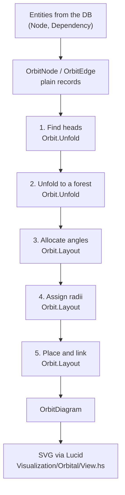

# The Orbital Dependency-Weighted Graph

> **Status: not built.** Nothing described here exists in the codebase
> yet. This is the design, written ahead of the implementation the way
> [`visualization-switching.md`](visualization-switching.md) was written
> ahead of the visualizations it describes (#213), so that the
> conventions are decided deliberately rather than set by whichever part
> lands first. Specified in #229.
>
> **It is a third visualization, not a change to the two that exist.**
> `Layered` and `Rootless` are untouched by it. See
> [`visualization-switching.md`](visualization-switching.md) for how the
> app holds several drawings at once and what they may share.
>
> The one thing most worth understanding here: **a node is drawn once
> per dependent it has.** Everything else in this document follows from
> that single decision — the absence of crossings, the role of colour,
> the DOM ids, the geometry, and the upstream validation the design
> leans on.

## What it is, in one paragraph

The dependency graph is unfolded into a **forest of trees**, one per
*head* — a node nothing is waiting on. Each tree is drawn radially:
its head sits on the innermost ring, its dependencies on the next ring
out, their dependencies beyond that. Ring index is dependency depth.
The centre of the orbit is empty; like `Rootless`, the project node is
not in the drawing. Where a node has several dependents it cannot
belong to one tree, so it is **replicated** — drawn once in each tree
that reaches it, with its own dependencies replicated along with it.

## Why "dependency-weighted"

Because the drawing is weighted toward showing *dependencies* rather
than *nodes*. Every dependency relationship in the project gets its own
drawn instance, and the price is that node identity stops being
one-circle-one-node.

That is a deliberate trade, and it buys something the other two
visualizations cannot offer: **there are no crossing edges at all.**
Not minimised — structurally absent. `Layered` runs a crossing-reduction
heuristic in `Graph.Order` and never claims zero; `Rootless` improves on
it by removing the node that caused most of the crossings (#215), but
still cannot promise none. Here, every drawn node has exactly one
dependent and every tree owns a disjoint wedge of the circle, so there
is nothing for an edge to cross.

Read as a project-management picture rather than a graph-theory one:
each tree is a **work stream** ending in one deliverable, and reading
outward from a head tells you everything that deliverable is waiting on,
in order, without your eye ever having to follow a line across the
drawing. A node appearing in three streams is telling you it is a
genuine bottleneck for three separate outcomes — which the layered
drawing expresses as a node with three lines leaving it, and this one
expresses as three circles.

## Worked example

The example is the one in #229's reference images, so the algorithm can
be checked against a drawing that already exists.

Nodes `A`–`G`. Dependencies, in `project.dependency`'s own terms
(`node_id` *depends on* `to_node_id`):

| Dependent | depends on |
|---|---|
| `A` | `D` |
| `D` | `E` |
| `B` | `C` |
| `C` | `E` |
| `F` | `G` |
| `F` | `C` |

**Heads** — nodes nothing is waiting on — are `A`, `B` and `F`. Three
heads, three trees:

```
T_A:  A ← D ← E
T_B:  B ← C ← E
T_F:  F ← G
      F ← C ← E
```

Ten discs are drawn for seven nodes: `E` three times (once per stream
that reaches it), `C` twice (`B` and `F` both wait on it), and the rest
once each. Four of the ten are leaves (`E`, `E`, `G`, `E`).

Ring occupancy follows directly:

| Ring | Discs |
|---|---|
| 0 (innermost) | `A` `B` `F` |
| 1 | `D` `C` `G` `C` |
| 2 | `E` `E` `E` |

Two properties of this example are worth naming because they are easy
to get backwards:

- **`F` has two dependencies and is not replicated.** Replication is
  driven by *dependents*, not dependencies. A node waiting on several
  things is just a branch in its tree.
- **Replicating `C` replicated `E` with it.** A replica is a whole
  subtree, not a single circle. `E` appears under both copies of `C`
  and once more under `D`.

## Vocabulary

The term **head** is borrowed deliberately from
[`graph-rendering.md`](graph-rendering.md)'s account of
`Graph.Containment` (#211), where it already means "a node nothing else
is waiting on". It is the same set here. Reusing the word rather than
coining one keeps two parts of the app from having different names for
the same idea.

New terms, local to this visualization:

| Term | Means |
|---|---|
| **disc** | One drawn circle. A `(node, path)` pair — several discs may be the same node. |
| **replica** | A disc for a node that has more than one disc in the drawing. |
| **stream** | One tree of the unfolded forest: a head and everything it transitively waits on. |
| **ring** | The set of discs at one depth. Ring index is depth from the head. |
| **eye** | The empty disc-free area at the centre of the orbit. |

## The pipeline



Everything from `OrbitNode`/`OrbitEdge` to `OrbitDiagram` is pure. The
responder does the I/O on either side of it and nothing else — the same
division `graph-rendering.md` describes for the layered engine, and for
the same reason.

## Module map

```
lib/src/Domain/Project/
  Orbit/                     -- pure: this visualization's geometry
    Types.hs                 -- every type below; no logic
    Unfold.hs                -- heads, and the DAG -> forest unfolding
    Layout.hs                -- angles, radii, placement, links
  Visualization/
    Orbital/
      Responder.hs           -- the handler
      View.hs                -- SVG rendering
```

### The one hard rule

**Nothing under `Domain.Project.Orbit.*` may import `Database.*`,
`persistent`, `Esqueleto`, `Lucid`, or anything from `Network.Wai`.**

This is the same rule `graph-rendering.md` states for
`Domain.Project.Graph.*`, restated here rather than referenced because
it has to hold for this tree independently. It is what keeps the
geometry inside the pure, dependency-free tier the unit suite covers
(see [`../development/unit-testing.md`](../development/unit-testing.md)),
and the invariants in [Testing](#testing) are only expressible from
inside that tier.

### Why `Orbit/` rather than under `Graph/`

`Domain.Project.Graph.*` is documented — in this directory, at length —
as *the layered layout engine*. It is shared infrastructure for
visualizations that want layered geometry, and both existing ones do.
Radial geometry shares none of its machinery: no layers, no dummy nodes,
no crossing reduction, no orthogonal routing, no tracks, no line jumps.
Putting it there would make "the layout engine" mean two unrelated
things and would quietly invite a `Visualization` flag into modules that
`visualization-switching.md` is explicit must never carry one.

`Orbit/` is a sibling tier: same purity rule, same test tier, different
geometry. This is exactly the case
[`visualization-switching.md`](visualization-switching.md#where-the-seam-moves-if-a-visualization-needs-more)
anticipates — "a visualization that is not layered at all — a radial or
force-directed one — simply does not import `Domain.Project.Graph.*`;
it brings its own geometry."

## Core types

```haskell
-- Domain.Project.Orbit.Types

newtype NodeId = NodeId Int64  deriving (Eq, Ord, Show)

data OrbitNode = OrbitNode
  { onId    :: NodeId
  , onLabel :: Text          -- raw title; wrapped during rendering
  }

data OrbitEdge = OrbitEdge
  { oeDependent  :: NodeId   -- the one waiting; drawn nearer the eye
  , oeDependency :: NodeId   -- the one waited on; drawn further out
  }

-- | One drawn circle. 'dNode' is not unique across a drawing.
data Disc = Disc
  { dNode    :: NodeId
  , dReplica :: Int          -- 0-based ordinal among this node's discs
  , dRing    :: Int          -- depth from the head; 0 is innermost
  , dAngle   :: Double       -- radians, clockwise from 12 o'clock
  , dCentre  :: Point
  , dLines   :: [Text]       -- label, already wrapped to the circle
  }

-- | The segment from a disc to the disc it is a dependency of.
data Link = Link
  { lFrom :: Point           -- on the dependency's rim (outer)
  , lTo   :: Point           -- on the dependent's rim (inner); the arrowhead
  }

data OrbitDiagram = OrbitDiagram
  { odDiscs  :: [Disc]
  , odLinks  :: [Link]
  , odBounds :: Bounds
  }

data OrbitConfig = OrbitConfig
  { cfgDiscRadius  :: Double  -- every disc is the same size
  , cfgDiscGap     :: Double  -- minimum arc clearance between discs
  , cfgMinRingGap  :: Double  -- minimum radial distance between rings
  , cfgEyeRadius   :: Double  -- clear space at the centre
  , cfgLabelWidth  :: Int     -- characters per label line
  , cfgLabelLines  :: Int     -- maximum label lines
  , cfgMargin      :: Double  -- padding around the whole drawing
  }
```

And the entry point:

```haskell
-- Domain.Project.Orbit.Layout
orbit :: OrbitConfig -> [OrbitNode] -> [OrbitEdge] -> OrbitDiagram
```

`orbit` is **total**, on the same terms as the layered engine's
`layout`: it must produce a diagram for any input — an empty graph,
isolated nodes, duplicate edges, an edge naming a node that is not
present, or a cycle. It never fails and never refuses to draw.

**`OrbitEdge` names its ends for the relationship, not `source`/
`target`.** This is the guard rail `graph-rendering.md` argues for at
length, and the reasoning carries over unchanged: the app has already
drawn its arrowheads on the wrong end once (#181) and sunk its root to
the bottom of the drawing for eight issues (#198), both because a field
called `source` does not tell you which end is waiting.

## Phase contracts

### 1. Find heads — `Orbit.Unfold`

A **head** is a node with no dependents: no `project.dependency` row
names it as a `to_node_id`. A node with neither dependencies nor
dependents is its own head and its stream is a single disc.

**Guarantees:** every node is reachable from at least one head, unless
it is in a cycle (see [Cycles](#cycles)). The head set is the same one
`Graph.Containment` computes for #211, on the same data.

### 2. Unfold to a forest — `Orbit.Unfold`

For each head, walk outward along dependency edges, materialising one
disc per node visited on each distinct path. A node reached by two
different paths becomes two discs, each carrying its own copy of
everything beyond it.

The result is a forest of trees. **In the drawing, every disc has
exactly one dependent** — that is the property the whole design rests
on, and it is what unfolding buys.

Order is fixed for determinism: heads by `NodeId`, and each disc's
children by `NodeId`.

**Guarantees:** the drawn structure is acyclic and every disc but a head
has exactly one outward edge to its dependent. The number of discs
equals the number of distinct dependency paths starting at a head.

#### On the size of the result

Unfolding is **unbounded by design.** There is no cap, no truncation
and no collapse rule.

That is a decision, not an oversight, and it is only defensible because
of where this app draws the line: it is an opinionated tool for managing
projects, and the intent is that it constrains the *project* rather than
the *picture*. A project whose dependency structure unfolds into
thousands of discs is a project that should have been split, and the
right place to say so is a validation and a suggestion at the point
someone records the dependency — not a renderer that silently draws less
than it was given. A drawing that quietly truncates is a drawing that
lies about the project.

The consequence is that this visualization has an upstream dependency on
that validation existing. See
[What this design assumes](#what-this-design-assumes-upstream).

### 3. Allocate angles — `Orbit.Layout`

Leaves of the forest are the unit of angular space. With `L` leaves in
total, each leaf gets `2π / L`, assigned in the traversal order fixed by
phase 2, so every stream ends up owning one contiguous wedge.

A non-leaf disc's angle is the **mean of its children's angles**. An
even number of children therefore centres a parent between them, which
is the commonest shape and the one an alternative rule would visibly get
wrong — the same argument `Graph.Coord` makes for averaging the middle
two neighbours rather than picking one.

Because a mean of angles is a convex combination of them, a disc always
lands inside its own subtree's wedge. That is what makes the drawing
planar, and it is stated as an invariant below rather than left implied.

**Guarantees:** sibling subtrees occupy disjoint angular spans; a
stream's span is contiguous; every disc's angle lies within its own
subtree's span.

#### The single-head case

A forest of one tree has no meaningful angular mean for its root — its
subtree spans the whole circle, and the mean of angles spread over 2π is
degenerate. So **when there is exactly one head, that head is placed at
the centre** and every ring shifts outward by one.

This is the one case where the eye is occupied, and it is worth calling
out because it is not rare: a project whose work all converges on a
single deliverable is an ordinary shape, not a pathological one. The
rule "the centre is empty" describes what the drawing does when there
is more than one stream, which is what makes an empty eye meaningful —
it says *these streams are independent*.

### 4. Assign radii — `Orbit.Layout`

Rings are placed outward from the eye, each one far enough out that the
discs on it clear each other:

```
r₀ = cfgEyeRadius
rₖ = max (rₖ₋₁ + cfgMinRingGap)
         ((2 * cfgDiscRadius + cfgDiscGap) / minAngularGapₖ)
```

where `minAngularGapₖ` is the smallest angular distance between any two
adjacent discs on ring `k`. A ring holding one disc imposes no
constraint and takes the minimum spacing.

**Rings are not evenly spaced**, and that is deliberate. The angular gap
between neighbours shrinks as subtrees subdivide, so an outer ring
generally needs more room than the minimum; deriving the radius from the
demand on that particular ring keeps the eye small on shallow projects
instead of sizing the whole drawing for its worst ring. This mirrors the
layered engine, where row spacing likewise follows from what actually
has to fit in a gap rather than from multiplying an index.

The trivially-correct alternative — one radius large enough that `L`
evenly-spaced discs never touch, applied to every ring — is rejected for
producing an enormous empty eye on any project with many leaves.

**Guarantees:** radius strictly increases with ring index; no two discs
on the same ring are closer than `2 * cfgDiscRadius + cfgDiscGap`.

### 5. Place and link — `Orbit.Layout`

A disc's centre is `(rₖ sin θ, −rₖ cos θ)` from the eye — angle measured
clockwise from 12 o'clock, which puts the first stream at the top of the
drawing where a reader looks first.

Links are **straight segments** between disc centres, trimmed at both
rims so they run rim to rim. The arrowhead sits on the **inner** end —
the dependent, the one waiting — which is the same rule the rest of the
app follows and is why the arrows in the reference images all point
inward.

There is no orthogonal routing here, and consequently none of
`Graph.Route`'s machinery applies: no ports, no tracks, no polylines, no
line jumps. Line jumps exist in the layered drawing because two
orthogonal runs meeting at a `+` are ambiguous between "these cross" and
"these meet". Here nothing crosses, so the ambiguity has no way to
arise.

**Guarantees:** every link is a single straight segment; no two links
intersect except at a shared rim; no link passes through a disc.

## Cycles

**Cycles are prevented upstream and are not depicted.** A cycle is
meaningless as a project statement — work that cannot start until it has
finished — and the decision recorded on #205 is to reject one at write
time rather than draw it. Unlike the layered engine, this visualization
has nothing sensible to show for one: unfolding a cycle does not
terminate, and there is no equivalent of "reverse a back edge and carry
on" that leaves the drawing honest.

**It still needs a termination backstop, and that is not the same
thing.** `project.dependency` permits cycles at the schema level —
`UNIQUE (node_id, to_node_id)` stops duplicate edges, not loops — so a
row can still arrive by seed script, direct SQL, or from before the
validation existed. So phase 2 stops expanding a branch when a node
would repeat on its own ancestor path.

The distinction matters because the two failure modes are not
comparable. A layered drawing handed a cycle draws something slightly
wrong. An unfolding handed a cycle **does not terminate** — it hangs the
request, and it does so in a phase that is otherwise pure and total. The
backstop is there so that a single malformed row cannot take the server
down, and `graph-rendering.md` already argues the general form of this
point: *a renderer that assumes well-formed input is a renderer a single
database row can break.*

The backstop is a safety property, not a feature. Nothing in the drawing
announces that it fired, because by the time it fires the data is
already invalid and the fix is upstream.

## Identity: colour, and the replica problem

A reader looking at three lavender `E` circles has to know they are one
node. In the layered drawings that question never arises, so nothing in
the app currently answers it.

### Colour is per node, and stable

Every node gets a hue, identical across all of its replicas and stable
across renders. Assignment is a **golden-angle rotation** over the
node's index in a stable ordering of the project's nodes:

```
hue = (index * 137.508°) mod 360
```

which spreads adjacent indices to opposite sides of the wheel and needs
no palette table. Hashing the node id was considered and rejected: it
gives no spread guarantee, so a small project can easily draw two
neighbouring nodes in near-identical colours — which in this
visualization is not a cosmetic problem but a false statement that they
are the same node.

### Where the colour lives

`graph-rendering.md` is firm that **only geometry is emitted as
attributes** — fill, stroke, hover and the flash animation all live in
`manage-project.css`, keyed off the node's class. A per-node hue cannot
live in a static stylesheet, so this needs resolving rather than
quietly breaking.

The resolution: the disc group carries a CSS custom property
`--node-hue`, and the stylesheet computes everything from it.

```html
<g class="disc work" data-node-id="42" style="--node-hue: 137.5">
```

```css
.disc .disc-shape { fill: hsl(var(--node-hue) var(--disc-sat) var(--disc-light)); }
```

What is emitted is a *datum* — which node this is — not an appearance
decision. Saturation, lightness, the dark-theme variants, hover and the
highlight glow all stay in CSS where the existing rule wants them, and a
theme change still lands in one file. That is the narrowest reading that
satisfies both constraints, and it is the one to hold: if a second
appearance value ever starts being emitted per disc, the rule has been
broken rather than bent.

### Hovering a disc highlights every replica

Colour alone does not scale past a few dozen nodes, so identity is also
interactive: hovering or selecting any disc highlights every disc with
the same `data-node-id`.

This is hyperscript on the disc, not a new script file — the same `h_`
attribute pattern the app already uses for small declarative effects
(see [`../development/frontend/`](../development/frontend/)) — and it
reuses the existing `.node-highlight` glow rather than inventing a
second highlight style:

```
on mouseenter add .node-highlight to <[data-node-id='42']/>
on mouseleave remove .node-highlight from <[data-node-id='42']/>
```

CSS cannot express this on its own: there is no selector for "every
element sharing an attribute value with the hovered one". That is the
whole reason it needs a behaviour at all, and worth writing down so
nobody spends an afternoon looking for the selector.

## The DOM contract

`graph-rendering.md` lists `#node-<id>` and `#node-text-<id>` as
contracts, depended on by CSS, the node-detail interaction, the
per-node refresh hook and the E2E suite. **Replicas break both**: several
circles would carry the same id, and one edit would fire several
identical refresh requests that all swap into whichever element matched
first.

So this visualization uses its own ids, under a **different prefix**:

| Selector | Notes |
|---|---|
| `#tree-container`, `#tree-view`, `#graph-zoom-layer` | Unchanged — this is what lets `graph-viewport.js` work with no modification |
| `#graph-nodes`, `#graph-links` | Unchanged |
| `#disc-<id>-<replica>` | Replaces `#node-<id>`. Unique per drawn circle |
| `#disc-text-<id>-<replica>` | Replaces `#node-text-<id>` |
| `data-node-id="<id>"` | The identity handle: shared by every replica, and what the highlight behaviour selects on |
| `.disc` | Replaces `.node` |
| `.root` / `.work` | Kept, so existing state styling still applies |

**A different prefix rather than a longer `#node-` id is the point.**
Anything still querying `#node-<id>` — a stylesheet, a test, a future
hook — should find nothing in an orbital drawing rather than silently
matching one arbitrary replica. Silent partial matches are how the
`node-label` bug in #173 survived to #178.

`.node` becoming `.disc` means `manage-project.css` needs orbital rules
of its own rather than inheriting the layered ones. That is intended:
the two drawings size and colour their shapes differently, and sharing a
class would make every future layered tweak a change to this drawing
too.

### The refresh hook

Each replica carries its own hook, targeting its own
`#disc-text-<id>-<replica>`. Since the existing trigger already filters
on `event.detail.nodeId`, editing a node fires one refresh request per
replica.

That is accepted rather than optimised. It is correct, needs no new
endpoint, and the request count is bounded by the same upstream ceiling
on dependents that bounds the drawing itself. The alternative — a single
hook returning `hx-swap-oob` fragments — was rejected because it would
require `Node.Refresh` to know how many replicas the current drawing
has, which is layout knowledge leaking into an endpoint that is shared
with the other two visualizations.

## Labels

Discs are a **fixed size** and labels wrap to fit, via the existing
`Data.Text.Util.wrapLabel` — the same approach and the same reasoning as
the layered drawing: the server cannot measure rendered text, and fixing
the shape sidesteps needing a font-metrics table.

A circle fits fewer characters per line than a box of the same width.
`graph-rendering.md` records the figure from when the app last drew
circles: `cfgLabelWidth` 12, against 18 for the rect it became in #178.
**Use 12.** Full titles remain available in the node detail panel.

## Viewport

`graph-viewport.js` works unchanged, and deliberately so — pan, zoom,
the drag-vs-click threshold and the listener teardown are all
independent of what the drawing contains.

One detail falls out nicely. `templateServerGraph` emits
`data-root-x`/`data-root-y` for the viewport to open on, and falls back
to the centre of the drawing's natural size when there is no root. An
orbital drawing has no root — and its centre *is* the eye, which is
exactly where a reader should start. So Orbital emits no root anchor and
gets the right opening position from the existing fallback.

## Where the seam is, and why it has to move

The per-visualization surface today is:

```haskell
type BuildGraph =
  Int64 -> [Entity M.Node] -> [Entity M.Dependency] -> ServerGraph
```

and `ServerGraph` carries a `Diagram`, which `serverGraph` produces by
calling the shared layered engine:

```haskell
serverGraph pid lns les =
  ServerGraph { …, sgDiagram = layout defaultLayoutConfig lns les }
```

**Orbital cannot be expressed through that seam.** It does not produce a
`Diagram`, because a `Diagram` is layered geometry: `PlacedNode` has no
angle and no replica ordinal, `PlacedEdge` is a polyline with jump
points, and `templateServerGraph` renders rects, orthogonal paths and
`#node-<id>` ids.

The seam moves out one step, from "decide the nodes and edges" to
"render the drawing":

```haskell
-- Domain.Project.Visualization.Common
type RenderGraph =
  Int64 -> [Entity M.Node] -> [Entity M.Dependency] -> Html ()

handleGraphWith :: RenderGraph -> ConnectionPool -> Application
```

`Layered` and `Rootless` are then thin compositions of the pieces they
already use —

```haskell
render pid ns ds = templateServerGraph (serverGraph pid (nodesFor ns) (edgesFor ds))
```

— and `BuildGraph`, `serverGraph` and `templateServerGraph` all survive
untouched as the shared machinery of the *layered* visualizations.
Orbital supplies its own `RenderGraph` and imports none of them.

What stays shared is the part that was never about geometry:
`validateProjectId`, `queryNodes`, `queryDependencies`, the error
responses, the node-detail links and `Data.Text.Util`. Two
visualizations asking the database the same question is not coupling.

**No flag crosses the seam.** Nothing gains a `Visualization` parameter;
what varies is a function, which is what
[`visualization-switching.md`](visualization-switching.md#3-the-isolation-rule)
requires.

### Selection

`Orbital` joins `Config.Visualization.Visualization`, and the switch in
`Domain.Project.Responder.Ui.Container` gains a third case.

Selected per request, `?visualizationMode=Orbital` — on the graph
fragment, or on the project page, which forwards it.

**It is also the default**, because #223's convention is that a request
naming no visualization gets whichever was added most recently, and this
is the most recent. That binding
(`Config.Visualization.defaultVisualization`) has to be updated by
whoever adds the next one; nothing fails if it is not.

This landed in the order #238 → #223: `Orbital` was first selected by
`GRAPH_VISUALIZATION`, and became a query parameter when that variable
was removed.

## What this design assumes upstream

Two of the decisions above are only safe because of validation that does
not exist yet. Recording them here so the dependency is visible rather
than discovered later:

| Assumption | Status |
|---|---|
| Cycles are rejected when a dependency is recorded | Decided on #205; not built. The [backstop](#cycles) covers the gap, and covers malformed data permanently. |
| A node cannot accumulate enough dependents to make unfolding explode | Filed separately; not built. Until then the [unbounded](#on-the-size-of-the-result) unfolding has no ceiling but the data's own shape. |

There is also a plain fact worth knowing before anyone builds this:
**#205 means there is currently no way to create a dependency at all.**
`Api.Node.Post` was the only writer of `project.dependency` and #198
removed the rows it wrote, so on a fresh database the table is empty.
Until #205 lands, an orbital drawing of a seeded project is one ring of
discs and no links — every node is a head. That is the algorithm working
correctly on the data it has, not a defect, but it does mean this
visualization cannot be meaningfully evaluated by eye until #205 is done.

## Testing

Specs mirror the module path, per
[`../development/unit-testing.md`](../development/unit-testing.md):

```
test/Domain/Project/Orbit/UnfoldSpec.hs
test/Domain/Project/Orbit/LayoutSpec.hs
```

**`hspec-discover` finds the files, but `typeio.cabal`'s
`test-suite spec` stanza lists every spec module under `other-modules`
by hand — a new spec that isn't added there is silently never run.**

The invariants each phase guarantees are the suite. At minimum:

- Every disc but a head has exactly one outward link.
- Disc count equals the number of distinct dependency paths from heads.
- Every node reachable from a head is drawn at least once.
- A node with *n* dependents produces at least *n* discs, and replicating
  it replicates its whole subtree.
- No two discs overlap.
- No two links intersect except at a shared rim, and no link crosses a
  disc — **on every fixture, asserted directly.** The no-crossings claim
  is this visualization's entire premise, so it is tested rather than
  argued from the construction.
- Every disc's angle lies within its own subtree's angular span, and
  sibling spans are disjoint.
- Ring radius increases strictly with ring index.
- A single-head forest puts its head at the centre.
- An input containing a cycle terminates and yields a complete diagram.
- An empty graph, and a graph of isolated nodes with no edges, both
  yield a complete diagram.
- The same input yields identical output across runs.

Integration coverage follows `Rootless.ResponderSpec`'s shape (see
[`visualization-switching.md`](visualization-switching.md#5-testing)):
the conversion takes `Entity` values and renders markup, so assert on
what comes out — the project node absent, replicas emitted with distinct
`#disc-<id>-<replica>` ids and a shared `data-node-id`, and the positive
case, since every one of those would also pass on a visualization that
drew nothing.

E2E coverage is warranted, since the acceptance criteria involve a
user-facing flow: hovering a replica highlights its siblings, and the
viewport opens on the eye. The issue that builds this carries `run-e2e`.

## Deliberately out of scope

Dragging discs, collapsing streams, animated or incremental relayout,
link labels, showing the project node, and *stability under change* — a
drawing is deterministic for a given input, but adding one dependency
can re-partition the streams and legitimately produce a very different
picture. That last one is a sharper limitation here than it is for the
layered drawing, and it is a known cost of the unfolding rather than
something to design around.
