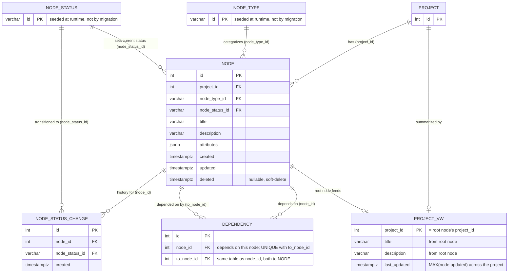

# Database Schema

The `project` schema is the entire persisted model for this app: one
schema, six tables, and one view, all created by
[migrations](../../../migrations/) `000001` through `000008`. This doc
is a reference for what those tables *mean* and how they relate — the
column lists here are a snapshot, not the source of truth. If a column
list ever looks stale, the migration that created (or last altered) the
table is always the authority; this doc links each table to it rather
than trying to stay byte-for-byte in sync.

The Haskell side of the model is `Domain.Project.Model`
(`lib/src/Domain/Project/Model.hs`), a `persistent`/`esqueleto`
`persistLowerCase` block that mirrors most of these tables — it's cited
per-entity below and is a second, corroborating source alongside the
DDL. Two things below exist in the database but **not** in that model:
`project.node.attributes` and `project.node_status_change` — see their
sections for why that's worth knowing.

## Entities

### `project.project`

Migration: `000002_add_project_table.up.sql`. Model: `Project` in
`Domain.Project.Model`.

```sql
CREATE TABLE project.project (
    id SERIAL PRIMARY KEY
);
```

The root container a set of nodes belongs to — deliberately just an
`id`. It has no `title`/`description` of its own; that's carried instead
by whichever `project.node` row is that project's *root node* (see
`project.project_vw` below). A "project" is really just a grouping key
that `project.node.project_id` points back at.

### `project.node`

Migration: `000005_create_node_table.up.sql`. Model: `Node` in
`Domain.Project.Model`.

```sql
CREATE TABLE project.node (
    attributes JSONB DEFAULT '{}'::jsonb,
    created TIMESTAMPTZ NOT NULL DEFAULT NOW(),
    deleted TIMESTAMPTZ NULL,
    description VARCHAR NOT NULL,
    id SERIAL PRIMARY KEY,
    node_status_id VARCHAR NOT NULL REFERENCES project.node_status(id),
    node_type_id VARCHAR NOT NULL REFERENCES project.node_type(id),
    project_id INT NOT NULL REFERENCES project.project(id),
    title VARCHAR NOT NULL,
    updated TIMESTAMPTZ NOT NULL DEFAULT NOW()
);
```

The core entity: a single task/node in a project's dependency graph.
Every node belongs to exactly one `project.project` (`project_id`), has
exactly one current type (`node_type_id`) and status
(`node_status_id`), and carries its own `title`/`description`.

A few columns worth calling out:

- `deleted TIMESTAMPTZ NULL` — soft-delete: a node is considered live
  when `deleted IS NULL`, and presumably filtered out that way by
  queries rather than ever being physically removed. There's no
  corresponding `deleted_by`/reason column, just the timestamp.
- `attributes JSONB DEFAULT '{}'::jsonb` — an open-ended bag of
  per-node data that doesn't (yet) warrant its own column. It's on the
  table in the database but **not** currently a field on the `Node`
  entity in `Domain.Project.Model` — the persistent model doesn't map
  it, so nothing in the Haskell code reads or writes it today even
  though the column exists and defaults to `{}`.
- `created`/`updated TIMESTAMPTZ NOT NULL DEFAULT NOW()` — both
  DB-defaulted on insert; `updated` is what `project.project_vw`
  aggregates over to find a project's most recent activity.
- A node whose `node_type_id = 'project_root'` is that project's *root
  node* — see `project.project_vw` below for what that means in
  practice.

### `project.node_type`

Migration: `000003_add_node_type_table.up.sql`. Model: `NodeType` in
`Domain.Project.Model`.

```sql
CREATE TABLE project.node_type (
    id VARCHAR PRIMARY KEY
);
```

A lookup table of valid `project.node.node_type_id` values — a plain
`VARCHAR` primary key, not a generated id. **No migration inserts any
rows here** — the two values the app actually uses (`project_root`,
`work`) are seeded at runtime by
`Domain.Central.Responder.Api.Seed.nodeTypes`
(`lib/src/Domain/Central/Responder/Api/Seed.hs`), which `insertUnique`s
them via the `handleSeedDatabase` responder (`make seed-db`). Whatever
rows exist in a given database are whatever that seed step has inserted
into it — not something you'll find by reading `migrations/` alone.

### `project.node_status`

Migration: `000004_create_node_status_table.up.sql`. Model:
`NodeStatus` in `Domain.Project.Model`.

```sql
CREATE TABLE project.node_status (
    id VARCHAR PRIMARY KEY
);
```

Same shape and same story as `node_type`: a `VARCHAR`-keyed lookup
table with no migration-inserted rows. `Domain.Central.Responder.Api
.Seed.nodeStatuses` seeds four values — `active`, `closed`, `open`,
`rejected` — the same way, via `handleSeedDatabase`.

### `project.node_status_change`

Migration: `000006_create_node_status_change_table.up.sql`. **Not**
present in `Domain.Project.Model` — no `persistent` entity currently
maps this table.

```sql
CREATE TABLE project.node_status_change (
    id SERIAL PRIMARY KEY,
    node_id INT NOT NULL REFERENCES project.node(id),
    node_status_id VARCHAR NOT NULL REFERENCES project.node_status(id),
    created TIMESTAMPTZ NOT NULL DEFAULT NOW()
);
```

An audit trail of status transitions: one row per time a node's status
changed, recording which node, which status it changed *to*, and when.
There's no `updated` column and nothing to undo a row with — it's
append-only by design, a log rather than a mutable record. As of this
writing, no Haskell code reads from or writes to this table (a search
of `lib/` turns up no reference to it at all), so the audit trail it's
meant to support isn't wired up yet.

### `project.dependency`

Migration: `000007_create_dependency_table.up.sql`. Model: `Dependency`
in `Domain.Project.Model`.

```sql
CREATE TABLE project.dependency (
    id SERIAL PRIMARY KEY,
    node_id INT NOT NULL REFERENCES project.node(id),
    to_node_id INT NOT NULL REFERENCES project.node(id),
    CONSTRAINT unique_dependency UNIQUE (node_id, to_node_id)
);
```

A directed edge in the dependency graph, between two rows of the same
table: `node_id` depends on `to_node_id` (`node_id → to_node_id`). Both
foreign keys point at `project.node` — this is the one non-obvious
relationship shape in the schema, a table with two FKs to the same
parent table rather than to two different tables.

`UNIQUE (node_id, to_node_id)` prevents the same directed edge from
being inserted twice — it stops **parallel edges**, not cycles: nothing
in the schema itself stops `A → B` and `B → A` from coexisting, or a
longer cycle from forming across several rows. Cycle prevention, if it
exists, is enforced in application code, not the database.

**A row here means work ordering, and nothing else.** It does *not*
record that a node belongs to a project — `node.project_id` does that.

Writing a row per node pointing at the project root to mean "belongs to
this project" duplicates `project_id` into a table that means something
else entirely. The graph reads such rows as real dependencies and draws
the project root beneath every node in the
project. Migration `000009` removed them, and nothing writes
them now; the graph derives membership from `project_id` instead. If
you are adding a writer here, it should be recording a genuine
dependency between two pieces of work.

## Views

### `project.project_vw`

Migration: `000008_project-vw.up.sql`. Model: `ProjectVw` in
`Domain.Project.Model` (a read-only view mapped with `Primary
projectId`).

```sql
CREATE VIEW project.project_vw AS
SELECT
  rn.project_id
  , rn.description
  , n.last_updated
  , rn.title
FROM
  project.node AS rn
  JOIN
  (  SELECT
        _n.project_id,
        MAX(_n.updated) AS last_updated
     FROM
       project.node AS _n
     GROUP BY
       _n.project_id
  ) AS n ON n.project_id = rn.project_id
WHERE
  rn.node_type_id = 'project_root'
```

One row per project, built from that project's **root node** — the
single `project.node` row with `node_type_id = 'project_root'` — joined
to a per-`project_id` aggregate of `MAX(node.updated)` across *every*
node in that project (root and non-root alike), exposed as
`last_updated`. In other words: a project's displayed
title/description come from its root node, but its "last activity"
timestamp reflects work anywhere in the project's graph, not just edits
to the root node itself.

This is what backs the project index page — it's the "which projects
exist, what are they called, when did they last see activity" query,
without every caller having to re-write the root-node-plus-aggregate
join by hand.

## Relationships at a glance

- `project.node.project_id → project.project.id` — every node belongs
  to exactly one project; a project has many nodes (its root node, plus
  every other node in its graph).
- `project.node.node_type_id → project.node_type.id` — every node has
  exactly one type.
- `project.node.node_status_id → project.node_status.id` — every node
  has exactly one current status.
- `project.node_status_change.node_id → project.node.id` and
  `project.node_status_change.node_status_id → project.node_status.id`
  — each status-change row records one node transitioning to one
  status.
- `project.dependency.node_id → project.node.id` and
  `project.dependency.to_node_id → project.node.id` — both ends of a
  dependency edge are nodes; a node can appear as either end of many
  edges.
- `project.project_vw` is derived, not a stored relationship: it reads
  `project.node` twice (once filtered to root nodes, once aggregated by
  `project_id`) and joins the results.

## ER diagram



`DEPENDENCY`'s two relationships to `NODE` (`node_id` and `to_node_id`)
are the one shape in this schema that isn't a simple star: both foreign
keys reference the *same* parent table, which is what makes a
dependency edge a self-relationship on `node` rather than a join
between two distinct entities. `PROJECT_VW` is drawn against both
`PROJECT` and `NODE` as one-to-zero-or-one because it's a derived view,
not a stored table with its own foreign keys — a project only appears
in it once it has a root node.

## See also

- [`docs/development/onboarding.md`](../onboarding.md) — request
  lifecycle, including where a responder's DB access fits in.
- [`docs/development/integration-testing.md`](../integration-testing.md)
  — how tests seed/reset this schema (`testcontainers`, truncate-based
  isolation).
- CLAUDE.md's "Setup & Local Development" section — `make migrate-*`
  and `make seed-db` commands for standing up this schema locally.
